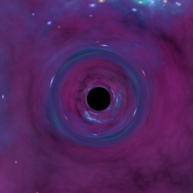
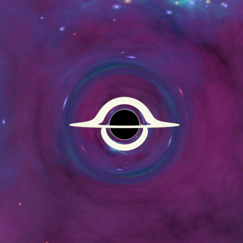
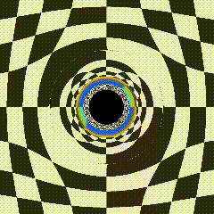

# blackness
A schwarzschild blackhole visualizer. 
It's essentially a raytracer for schwarzschild space~~time~~.

[中文说明]

## Astrophysics Simulation
I'm not good at math, and certainly not at physics. I just admire the beauty of physics. So I wrote this blackhole exterior raytracer for fun. 

I hope I got the equation right. It's simply a null geodesic of schwarzschild(non-rotating, non-charged) blackhole. And numerical integrate it to get the path of a light ray.

## Usage
download prebuilt binary from [releases].

This is a GUI program, and has a commandline interface(incomplete, mainly focus on gui). 

Here are some parameters on the right panel of the program.

- You can choose Image mode or Video mode. 
- The checkbox for Blackhole and Accretion Disk is to choose whether to have those objects in the scene.
- The skybox folder is the background image. Default is a chessboard skybox.  The folder must contain six skybox images whose name contains "front", "up", "top", "bottom", "right", "left". Or just a folder contain one image, for all six faces of skybox
- The disk texture part is a single disk texture file. Span the whole area of the accretion disk. See [resources/disk] for example. The texture doesn't support alpha channel for background blending at the moment.
- Disk radius is just like what the name implies. It specify the inner radius and outer radius of the accretion disk.
- Width and height are the resolution of the final generated image(or video). It doesn't support non-square scene yet, might implement it later.
- samples setting is the multi-sample sample count. Don't set it too high, it's proportional to the render time.
- Theads is the concurrent threads for rendering. Just set it to your core number. You might experience computer hang if you utilize all cores of your computer.
- Camera position and Camera Lookat is the position and lookat point in 3D cartesian space. The blackhole is set on (0,0,0).
- Post-processing is still a bit buggy. Use it when the rendering is finished.
- When the image is finished, use top left save as action to save the result image.

## Video Generating

You can combine sequence of image to a video. Use the video mode on the top right.

Camera position is specify by the Camera Position setting.

The file is constructed as follow:

- every line is camera setting for one frame
- one line has three component: position vector, camera-front vector, camera-up vector

see [resources/position/circular.txt] for example

Video generating output path is currently hard-coded. It will save automatically in the program directory with extension "mp4".

## Credit
Thanks for [eigenchris] for amazing tensor calculus courses. 

Thanks for apc-llc's [code for encoding] video.

[中文说明]:README_zh.md
[resources/position/circular.txt]:resources/position/circular.txt
[resources/disk]:resources/disk
[code for encoding]:https://github.com/apc-llc/moviemaker-cpp
[eigenchris]:https://www.youtube.com/user/eigenchris/videos
[releases]:https://github.com/evopen/blackness/releases
